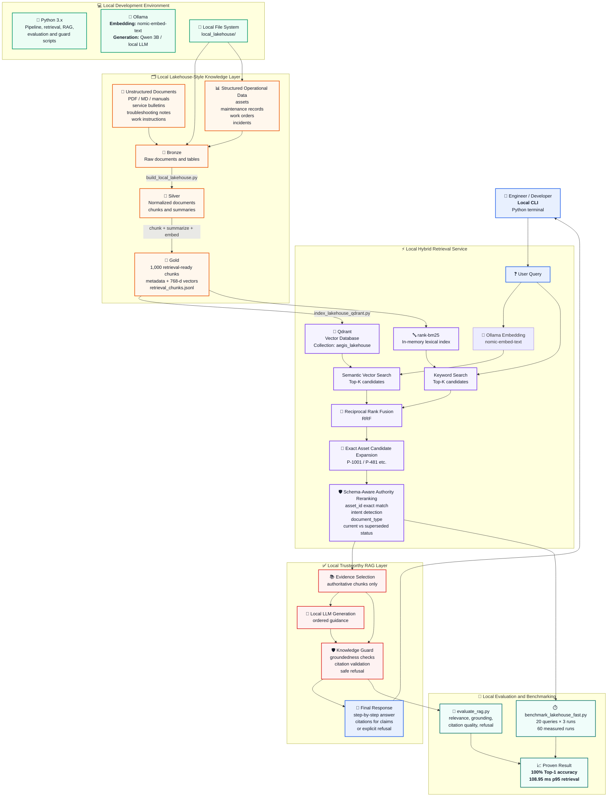

# 1. Current Local MVP Architecture



## Current Local MVP Components

| Layer | Current implementation |
|---|---|
| Data generation | `generate_synthetic_corpus.py` |
| Lakehouse transformation | `build_local_lakehouse.py` |
| Gold retrieval corpus | `local_lakehouse/gold/retrieval_chunks.jsonl` |
| Vector index | Qdrant |
| Embeddings | Ollama `nomic-embed-text` |
| Keyword search | Local `rank-bm25` BM25 index |
| Hybrid fusion | Reciprocal Rank Fusion |
| Authority layer | Exact `asset_id` matching, intent detection, document-type and status-aware reranking |
| RAG trust controls | `knowledge_guard.py`, citation validation, refusal handling |
| Retrieval evaluation | `benchmark_lakehouse_fast.py` |
| RAG evaluation | `evaluate_rag.py` |
| Frontend | Python CLI / scripts |
| Access scope model | Metadata field: `access_scope` |

## Proven Local Evidence

```text
Corpus:                       1,000 Gold retrieval chunks
Retrieval mode:               Qdrant Vector + BM25 + RRF + schema-aware reranking
Benchmark questions:          20
Measured retrieval runs:      60
Top-1 retrieval accuracy:     100.00%
p95 retrieval latency:        108.95 ms
Sub-second requirement:       PASS
```

---

# 2. Target Azure-Native Enterprise Architecture

```mermaid
flowchart TB
    Engineer["👷 Engineer<br/>Enterprise user"]

    subgraph MicrosoftCloud["☁️ Microsoft Azure and Microsoft Fabric"]
        direction TB

        subgraph Experience["🗨️ Conversational Experience"]
            Copilot["🤖 Microsoft Copilot Studio<br/>AEGIS Assistant UI"]
        end

        subgraph IdentitySecurity["🔐 Identity, Security and Governance"]
            Entra["🪪 Microsoft Entra ID<br/>authentication<br/>user identity, groups and roles"]

            Purview["🏷️ Microsoft Purview<br/>sensitivity labels<br/>classification and governance"]

            KeyVault["🔑 Azure Key Vault<br/>secrets and configuration"]

            ManagedIdentity["🆔 Managed Identity<br/>passwordless service access"]
        end

        subgraph APIPlatform["🚀 API and Trust Layer"]
            APIM["🌐 Azure API Management<br/>API gateway<br/>OAuth / policies / rate limits"]

            ContainerApps["📦 Azure Container Apps<br/>stateless AEGIS FastAPI"]

            API["🛡️ AEGIS Trust and Authority API<br/>asset + intent extraction<br/>Entra scope resolution<br/>authority policy<br/>citations + grounding + refusal"]

            APIM --> ContainerApps
            ContainerApps --> API
        end

        subgraph FabricPlatform["🏗️ Microsoft Fabric Data Platform"]
            FabricPipeline["🔄 Fabric Data Pipeline<br/>scheduled refresh"]

            OneLake["🗄️ OneLake<br/>governed enterprise data foundation"]

            BronzeAzure["🥉 Fabric Lakehouse Bronze<br/>raw documents and<br/>operational source tables"]

            SilverAzure["🥈 Fabric Lakehouse Silver<br/>normalized documents<br/>chunks + summaries"]

            GoldAzure["🥇 Fabric Lakehouse Gold<br/>retrieval records<br/>metadata + vectors"]

            OperationalTables["📊 Structured Tables<br/>assets, maintenance records<br/>work orders, incidents"]

            EnterpriseDocs["📄 Enterprise Documents<br/>manuals, bulletins<br/>troubleshooting, procedures"]

            EnterpriseDocs --> BronzeAzure
            OperationalTables --> BronzeAzure
            BronzeAzure --> SilverAzure
            SilverAzure --> GoldAzure

            OneLake --- BronzeAzure
            FabricPipeline --> BronzeAzure
            FabricPipeline --> SilverAzure
            FabricPipeline --> GoldAzure
        end

        subgraph AIPlatform["🧠 Azure AI Platform"]
            AzureOpenAIEmbedding["🧠 Azure OpenAI<br/>Embedding Deployment<br/>Target: text-embedding-3-small<br/>Optional: text-embedding-3-large"]

            AzureAISearch["🔎 Azure AI Search<br/>Hybrid Search<br/>vector + lexical keyword<br/>native RRF + OData filters"]

            AzureOpenAIGeneration["🤖 Azure OpenAI<br/>Chat Deployment<br/>Target: GPT-4.1-mini<br/>Fallback: GPT-4o-mini"]

            GoldAzure -->|"index records + vectors"| AzureAISearch
            GoldAzure -->|"embedding generation"| AzureOpenAIEmbedding
        end

        subgraph Observability["📈 Observability and Operations"]
            AppInsights["📊 Application Insights<br/>distributed traces<br/>latency and exceptions"]

            AzureMonitor["📉 Azure Monitor<br/>alerts and dashboards"]

            CostManagement["💰 Azure Cost Management<br/>budget alerts<br/>resource tags"]

            AppInsights --> AzureMonitor
        end
    end

    Engineer --> Copilot
    Copilot -->|"signed-in identity"| Entra
    Copilot -->|"HTTPS Custom Connector"| APIM

    Entra -->|"groups / roles"| API
    Purview -->|"labels / classifications"| API
    KeyVault -->|"secrets"| ContainerApps
    ManagedIdentity -->|"service authorization"| KeyVault

    API -->|"asset_id + intent + authorized scopes"| AzureAISearch
    API -->|"structured operational lookup"| GoldAzure

    AzureAISearch -->|"authorized evidence only"| API
    API -->|"grounded evidence context"| AzureOpenAIGeneration
    AzureOpenAIGeneration -->|"draft answer"| API

    API -->|"traces, retrieval latency,<br/>refusals, citation validation"| AppInsights
    API -->|"cited answer or refusal"| APIM
    APIM --> Copilot
    Copilot --> Engineer

    classDef user fill:#E8F0FE,stroke:#2563EB,color:#111827,stroke-width:2px;
    classDef azure fill:#E0F2FE,stroke:#0284C7,color:#111827,stroke-width:2px;
    classDef fabric fill:#F3E8FF,stroke:#9333EA,color:#111827,stroke-width:2px;
    classDef security fill:#FEF3C7,stroke:#D97706,color:#111827,stroke-width:2px;
    classDef ai fill:#ECFDF5,stroke:#059669,color:#111827,stroke-width:2px;
    classDef api fill:#FFF7ED,stroke:#EA580C,color:#111827,stroke-width:2px;
    classDef observe fill:#F1F5F9,stroke:#475569,color:#111827,stroke-width:2px;

    class Engineer,Copilot user;
    class Entra,Purview,KeyVault,ManagedIdentity security;
    class APIM,ContainerApps,API api;
    class FabricPipeline,OneLake,BronzeAzure,SilverAzure,GoldAzure,OperationalTables,EnterpriseDocs fabric;
    class AzureOpenAIEmbedding,AzureAISearch,AzureOpenAIGeneration ai;
    class AppInsights,AzureMonitor,CostManagement observe;
```



## Azure-Native Data and Request Flow

### Scheduled knowledge refresh flow

```text
Fabric Data Pipeline schedule
    → Ingest documents and operational tables into Bronze
    → Normalize data into Silver
    → Chunk, summarize and enrich document metadata
    → Generate Azure OpenAI embeddings
    → Publish Gold retrieval records
    → Update Azure AI Search index
    → Log pipeline status, record counts and failures
```

### Engineer question flow

```text
Engineer asks AEGIS through Copilot Studio
    → Copilot Studio obtains signed-in Entra identity
    → Request is sent through Azure API Management
    → AEGIS API resolves user roles and authorized scopes
    → API extracts asset ID and question intent
    → Azure AI Search runs hybrid vector + keyword retrieval
       with permission and metadata filters
    → Authority policy selects current and appropriate evidence
    → Azure OpenAI generates ordered guidance from evidence only
    → Citation/grounding guard verifies support for claims
    → API returns cited answer or explicit refusal
    → Copilot Studio displays response and sources
```

## Target Azure Component Responsibilities

| Azure component | Responsibility |
|---|---|
| **Microsoft Fabric Lakehouse** | Governed system of record for raw, normalized and Gold knowledge assets |
| **Fabric Data Pipeline** | Scheduled Bronze → Silver → Gold refresh and index publication |
| **Azure OpenAI embeddings** | Create vectors for Gold chunks and incoming user questions |
| **Azure AI Search** | Low-latency hybrid vector + lexical retrieval, RRF and metadata filtering |
| **Azure Container Apps** | Hosts stateless AEGIS FastAPI trust/authority service |
| **Azure API Management** | Secure, governed API endpoint for Copilot Studio |
| **Azure OpenAI chat model** | Generates concise, ordered and grounded engineering guidance |
| **Microsoft Entra ID** | User authentication, groups and authorization identity |
| **Microsoft Purview** | Data classification, sensitivity labels and governance evidence |
| **Azure Key Vault** | Secrets and service configuration |
| **Application Insights / Azure Monitor** | Latency monitoring, errors, traces, auditability and operational dashboards |
| **Copilot Studio** | Enterprise conversational frontend |
