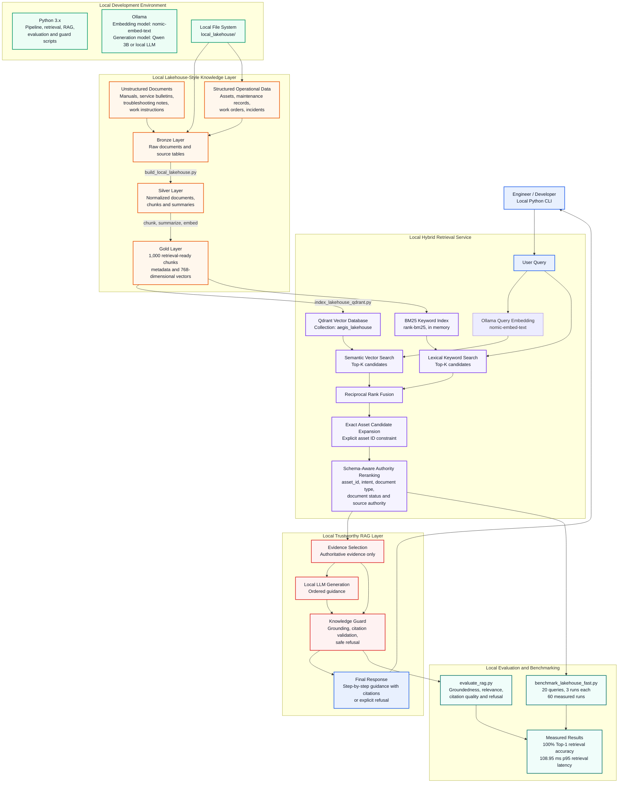

```mermaid
flowchart TB
    Engineer["Engineer"]

    subgraph MicrosoftCloud["Microsoft Azure and Microsoft Fabric"]
        direction TB

        subgraph Experience["User Experience"]
            Copilot["Microsoft Copilot Studio<br/>AEGIS Assistant"]
        end

        subgraph IdentityGovernance["Identity, Security and Governance"]
            Entra["Microsoft Entra ID<br/>Authentication, user identity,<br/>groups and roles"]

            Purview["Microsoft Purview<br/>Sensitivity labels,<br/>classification and governance"]

            KeyVault["Azure Key Vault<br/>Secrets and configuration"]

            ManagedIdentity["Managed Identity<br/>Passwordless service access"]
        end

        subgraph APIPlatform["Application and API Platform"]
            APIM["Azure API Management<br/>OAuth, policies, rate limits<br/>and API audit"]

            ContainerApps["Azure Container Apps<br/>Stateless AEGIS API hosting"]

            AegisAPI["AEGIS Trust and Authority API<br/>Asset and intent extraction<br/>Authorization policy<br/>Authority selection<br/>Citation validation and refusal"]

            APIM --> ContainerApps
            ContainerApps --> AegisAPI
        end

        subgraph FabricPlatform["Microsoft Fabric Knowledge Platform"]
            FabricPipeline["Fabric Data Pipeline<br/>Scheduled refresh"]

            OneLake["OneLake<br/>Governed data foundation"]

            BronzeAzure["Fabric Lakehouse Bronze<br/>Raw documents and<br/>operational source tables"]

            SilverAzure["Fabric Lakehouse Silver<br/>Normalized documents,<br/>chunks and summaries"]

            GoldAzure["Fabric Lakehouse Gold<br/>Retrieval records,<br/>metadata and embeddings"]

            OperationalTables["Structured Operational Tables<br/>Assets, maintenance records,<br/>work orders and incidents"]

            EnterpriseDocuments["Enterprise Documents<br/>Manuals, service bulletins,<br/>troubleshooting notes and procedures"]

            EnterpriseDocuments --> BronzeAzure
            OperationalTables --> BronzeAzure
            BronzeAzure --> SilverAzure
            SilverAzure --> GoldAzure

            OneLake --- BronzeAzure
            FabricPipeline --> BronzeAzure
            FabricPipeline --> SilverAzure
            FabricPipeline --> GoldAzure
        end

        subgraph AIPlatform["Azure AI and Retrieval Platform"]
            AzureOpenAIEmbedding["Azure OpenAI<br/>Embedding Deployment<br/>Target: text-embedding-3-small<br/>Optional: text-embedding-3-large"]

            AzureAISearch["Azure AI Search<br/>Hybrid vector and keyword retrieval<br/>RRF and OData metadata filters"]

            AzureOpenAIGeneration["Azure OpenAI<br/>Grounded response generation<br/>Target: GPT-4.1-mini<br/>Fallback: GPT-4o-mini"]

            GoldAzure -->|"embedding generation"| AzureOpenAIEmbedding
            GoldAzure -->|"index records and vectors"| AzureAISearch
        end

        subgraph Observability["Observability and Operations"]
            AppInsights["Application Insights<br/>Traces, latency, exceptions<br/>and audit telemetry"]

            AzureMonitor["Azure Monitor<br/>Alerts and dashboards"]

            CostManagement["Azure Cost Management<br/>Budgets, tags and alerts"]

            AppInsights --> AzureMonitor
        end
    end

    Engineer --> Copilot
    Copilot -->|"Signed-in identity"| Entra
    Copilot -->|"HTTPS Custom Connector"| APIM

    Entra -->|"Groups and roles"| AegisAPI
    Purview -->|"Labels and classifications"| AegisAPI
    KeyVault -->|"Secrets"| ContainerApps
    ManagedIdentity -->|"Authorized access"| KeyVault

    AegisAPI -->|"Asset ID, intent and authorized scopes"| AzureAISearch
    AegisAPI -->|"Structured operational lookup"| GoldAzure

    AzureAISearch -->|"Authorized evidence only"| AegisAPI
    AegisAPI -->|"Grounded evidence context"| AzureOpenAIGeneration
    AzureOpenAIGeneration -->|"Draft response"| AegisAPI

    AegisAPI -->|"Latency, retrieval traces,<br/>citation and refusal events"| AppInsights
    AegisAPI -->|"Cited response or refusal"| APIM
    APIM --> Copilot
    Copilot --> Engineer

    classDef user fill:#E8F0FE,stroke:#2563EB,color:#111827,stroke-width:2px;
    classDef security fill:#FEF3C7,stroke:#D97706,color:#111827,stroke-width:2px;
    classDef api fill:#FFF7ED,stroke:#EA580C,color:#111827,stroke-width:2px;
    classDef fabric fill:#F3E8FF,stroke:#9333EA,color:#111827,stroke-width:2px;
    classDef ai fill:#ECFDF5,stroke:#059669,color:#111827,stroke-width:2px;
    classDef observe fill:#F1F5F9,stroke:#475569,color:#111827,stroke-width:2px;

    class Engineer,Copilot user;
    class Entra,Purview,KeyVault,ManagedIdentity security;
    class APIM,ContainerApps,AegisAPI api;
    class FabricPipeline,OneLake,BronzeAzure,SilverAzure,GoldAzure,OperationalTables,EnterpriseDocuments fabric;
    class AzureOpenAIEmbedding,AzureAISearch,AzureOpenAIGeneration ai;
    class AppInsights,AzureMonitor,CostManagement observe;
```

AEGIS provides a hybrid retrieval service combining Qdrant semantic vector search and BM25 keyword search, fused through Reciprocal Rank Fusion. The service applies lightweight schema-aware reranking using explicit asset identifiers, document type, document status, and source authority.

# Current Local MVP Architecture

### Reproduction section

# 1. Start Qdrant
docker compose up -d

# 2. Ensure Ollama embedding model is available
ollama pull nomic-embed-text

# 3. Build / load the local Lakehouse and Qdrant index
python build_local_lakehouse.py

# 4. Run measured hybrid retrieval benchmark
python benchmark_lakehouse_fast.py

# Target Azure-Native Enterprise Architecture

